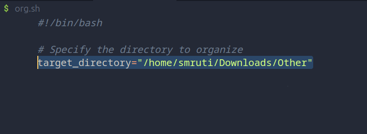

# File Organizing 
> [!IMPORTANT]
> Only works in linux / mac
> Bash Script /Shell Script

This Bash script is designed to organize files in a specified directory based on their types. It categorizes files into different subdirectories such as Images, Documents, Videos, SVGs, Music, WebP images, and Others.


## Usage

1. **Clone the Repository:**
```bash
git clone https://github.com/yourusername/file-organizing-script.git
```
2. **Navigate to the Script Directory:**

```bash
cd file-organizing-script
```

3. Replace the **target_directory** in the code
> [!TIP]
> Navigate to your file path
Run **pwd** in the terminal in the path you want to organized



3. **Make the Script Executable:**

```bash
chmod +x organize_files.sh
```

4. **Run the Script:**

```bash
./organize_files.sh
```
### Customization

You can customize the script by modifying the file types and corresponding directories in the script itself. Open the organize_files.sh script and update the sections where file types and directories are specified.

### Directory Structure

**Images/:** Directory for image files (e.g., jpg, jpeg, png, gif).
**Documents/:** Directory for document files (e.g., pdf, doc, docx, txt).
**Videos/:** Directory for video files (e.g., mp4, avi, mkv, mov).
**Svg/:** Directory for SVG image files.
**Music/:** Directory for music files (e.g., mp3, flac, wav).
**WebP/:** Directory for WebP image files.

### Important Notes

Ensure that you have a backup of your files before running the script.
The script assumes the target directory is specified in the target_directory variable.
Customize the script according to your needs and file types.

### License

This project is licensed under the MIT License.

Feel free to contribute and improve this script! If you encounter any issues or have suggestions, please open an issue or create a pull request.

Happy organizing!